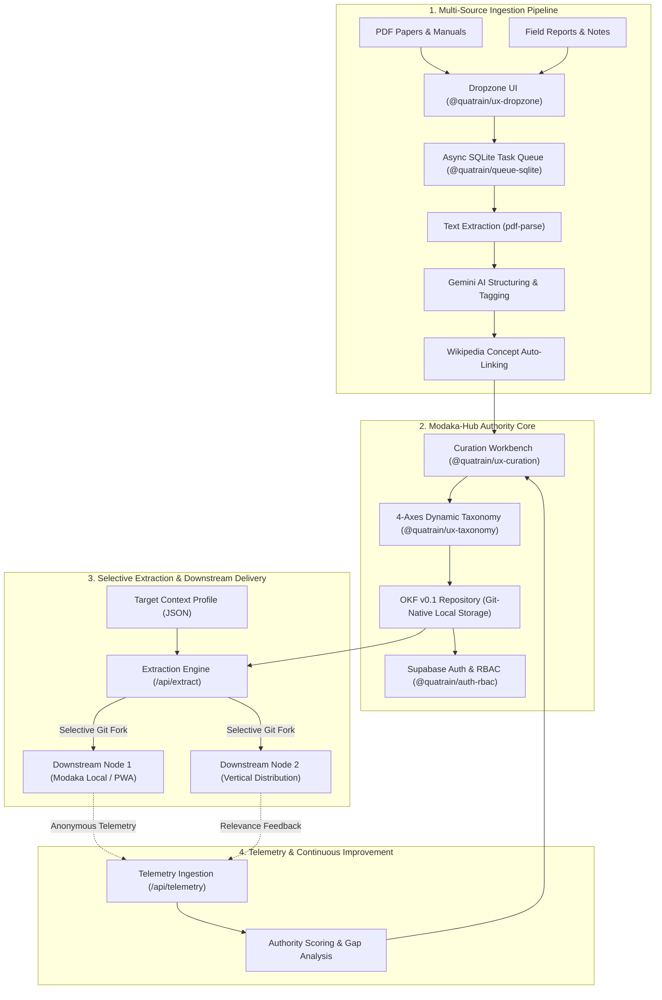

# Modaka-Hub 🌐📚

> **Collaborative Open Knowledge Curation, Central Authority & Multi-Axial Extraction Platform**  
> Powered by [Quatrain](https://github.com/Quatrain/Core), [Astro 5](https://astro.build), [React 18](https://react.dev), and the [Open Knowledge Format (OKF v0.1)](https://github.com/crapougnax/AGENTS.okf).

[](LICENSE.md)
[](https://nodejs.org/)
[](https://astro.build)
[](https://github.com/crapougnax/AGENTS.okf)
[](Containerfile)

---

## 🧭 1. Overview & Vision

**Modaka-Hub** is the central scientific and normative authority platform of the Quatrain knowledge ecosystem. It is engineered for expert collectives, scientific institutions, and technical organizations to ingest, curate, qualify, and distribute structured knowledge across orthogonal taxonomy axes.

While decentralized instances (**Modaka-Local** / PWA client hubs) serve individual organizations and field practitioners with hyper-personalized local-first data, **Modaka-Hub** acts as the global **Source of Authority (SOA)**:
- **Central Authority Repository (`quatrain/authority`)**: Manages normative, verified scientific knowledge with strict revision tracking.
- **Multi-Tenant Collaboration & RBAC**: Provides secure multi-curator workflows with fine-grained role-based access control and immutable audit trails.
- **Contextual Extraction Engine**: Filters and exports targeted subsets of the authority knowledge base into dedicated client repositories.
- **Dynamic Authority Scoring**: Aggregates anonymous telemetry and usage feedback from downstream nodes to guide gap analysis and continuous curation.

---

## 🏗️ 2. Architectural Topology



---

## ⚡ 3. Key Capabilities

### A. Open Knowledge Format (OKF v0.1) & Lineage Contract
Every document curated or exported strictly conforms to the Open Knowledge Format standard:
- **Strict Lineage Header**: Bounded by flat YAML frontmatter declaring `soa`, `revision`, `type`, `title`, and dynamic taxonomy tags.
- **Semantic Slugs**: Lowercase slugified directory paths (`content/<category>/<slug>.md`), eliminating arbitrary UUIDs.
- **Progressive Disclosure**: Token-efficient hierarchical `index.md` files generated per category for optimal navigation by human users and AI agents.

### B. Multi-Axial Taxonomy Engine
Documents are qualified across orthogonal dimensions defined dynamically in `modaka-hub.config.json`. By default, four fundamental axes are provided:
1. **Sols / Soils**: Pedological classifications (Calcisol, Luvisol, Vertisol, Arenosol...).
2. **Climats / Climates**: Agroclimatic zones (Méditerranéen, Océanique, Semi-aride...).
3. **Productions / Crops**: Crop categories (Viticulture, Arboriculture, Maraîchage, Grandes Cultures...).
4. **Itinéraires / Itineraries**: Cultural practices and technical itineraries (Semis direct, Enherbement permanent, Agroforesterie...).

### C. Asynchronous Non-Blocking Worker Queue
Heavy document parsing (PDF OCR, LLM extraction, Wikipedia concept lookup) runs through `@quatrain/queue-sqlite`. The foreground UI remains responsive with sub-second latency while progress is streamed in real time via `@quatrain/ux-dropzone`.

### D. Dual-Mode Curation Workbench
Curators can seamlessly toggle between:
- **Visual Form Editor**: Guided inputs with autocomplete, tag selectors, and validation constraints.
- **Raw YAML Editor**: Instant Monaco/Ace-style syntax-highlighted YAML editing with fail-fast validation.

### E. Enterprise RBAC & Field-Level Security
- **Supabase Auth**: Double-mode authentication supporting email/password and OAuth 2.0 PKCE with HTTP-only cookies.
- **Domain Whitelisting**: Strict email domain gating configurable via `ALLOWED_EMAIL_DOMAINS`.
- **Granular Roles**:
  - `admin`: Full administrative control, remote Git push, taxonomy schema modifications.
  - `curator`: Ingestion, document qualification, local Git commit.
  - `reviewer`: Scientific validation and peer review before publication.
  - `extractor`: Generation of contextual packs and selective client repository forks.
- **Field-Level Security (FLS)**: Lineage fields (`soa`, `revision`) are strictly `readonly` for non-admin users.

### F. Contextual Extraction Engine (`/api/extract`)
Extracts filtered subsets of the central authority repository matching specific client profiles (soil, climate, practices, constraints) and packages them into customizable OKF trees or initializes dedicated client Git repositories.

---

## 📁 4. Project Structure

```
modaka-hub/
├── .github/
│   └── workflows/
│       └── deploy.yml              # CI/CD: Container build, test & GHCR publish
├── config/                         # System configuration files
├── docs/                           # Architectural diagrams & specifications
├── src/
│   ├── components/                 # React UI components (Workbench, Dropzone, Taxonomy)
│   ├── layouts/                    # Astro base layouts
│   ├── lib/
│   │   ├── ai/                     # Gemini AI extraction adapters
│   │   ├── auth/                   # Supabase Auth client & RBAC middleware
│   │   ├── config.ts               # Fail-fast configuration container (@quatrain/config)
│   │   ├── git-sync.ts             # Git synchronization & atomic commits
│   │   └── queue.ts                # SQLite background worker queue
│   ├── middleware.ts               # Edge request interceptor & session handler
│   └── pages/
│       ├── api/                    # RESTful endpoints (curate, extract, queue, git)
│       ├── index.astro             # Main Curation Workbench interface
│       └── login.astro             # Authentication & SSO entrypoint
├── .dockerignore                   # Docker build context exclusions
├── .yarnrc.yml                     # Yarn Berry config (nodeLinker: node-modules)
├── astro.config.mjs                # Astro 5 configuration (Node standalone SSR)
├── Containerfile                   # Production multi-stage OCI Containerfile
├── modaka-hub.config.json.dist     # Default configuration template
└── package.json                    # Workspace manifests and dependencies
```

---

## 🚀 5. Getting Started

### Prerequisites
- **Node.js**: `v22.x LTS` or higher
- **Corepack & Yarn**: Yarn Berry (v4.x)
- **Git**: Installed and available in PATH
- **Podman** (or Docker): For local container validation

### Installation

```bash
# 1. Clone repository
git clone https://github.com/Quatrain/modaka-hub.git
cd modaka-hub

# 2. Enable Corepack and install dependencies
corepack enable
yarn install

# 3. Initialize configuration files
cp .env.dist .env
cp modaka-hub.config.json.dist modaka-hub.config.json
```

### Environment Variables

Configure the following variables in `.env`:

```ini
# Application Server
PORT=4322
HOST=0.0.0.0
NODE_ENV=development

# Authentication & Supabase
PUBLIC_SUPABASE_URL=https://your-project.supabase.co
PUBLIC_SUPABASE_ANON_KEY=your-anon-key
SUPABASE_SERVICE_ROLE_KEY=your-service-role-key
ALLOWED_EMAIL_DOMAINS=*

# AI Ingestion Provider
GEMINI_API_KEY=your-gemini-api-key

# Storage & OKF Data
OKF_DATA_DIR=/app/data/okf
OKF_SOA=quatrain/authority
```

### Development Server

```bash
yarn dev
```
Open [http://localhost:4322](http://localhost:4322) in your browser.

### Running Automated Tests

```bash
yarn test
```

### Production Build

```bash
# Build standalone Astro SSR bundle
yarn build

# Start production server
node dist/server/entry.mjs
```

---

## 🐳 6. Containerization & Deployment

Modaka-Hub is packaged as a standard OCI container conforming to rootless and unprivileged execution standards.

### Local Container Build (Podman / Docker)

```bash
# Build the container image
podman build -t quatrain/modaka-hub:latest -f Containerfile .

# Run the container
podman run -d \
  -p 4322:4322 \
  --name modaka-hub \
  --env-file .env \
  -v ./data:/app/data/okf:Z \
  quatrain/modaka-hub:latest
```

### Container Construction Chain (Inheritance Model)

Modaka-Hub serves as the **base engine container image** (`ghcr.io/quatrain/modaka-hub:latest`). Downstream vertical distributions (such as [Hey-Brad](https://github.com/bradtech/hey-brad)) build directly on top of this image without recompiling the application bundle:

```dockerfile
# Downstream Containerfile Example
FROM ghcr.io/quatrain/modaka-hub:latest

# Inject organization-specific taxonomy and agronomic configuration
COPY modaka-hub.config.json /app/modaka-hub.config.json

ENV PORT=4322
CMD ["node", "./dist/server/entry.mjs"]
```

---

## 📚 7. Technical Documentation

- [MODAKA_HUB_ARCHITECTURE.md](MODAKA_HUB_ARCHITECTURE.md) — Strategic vision and detailed component design.
- [POC_WORKBOOK.md](POC_WORKBOOK.md) — Step-by-step reproduction and verification workbook.
- [HOWTO.md](HOWTO.md) — Curator usage scenarios and common workflows.
- [AGENTS.md](AGENTS.md) — LLM coding agent instructions and conventions.

---

## 📜 8. License

Distributed under the **AGPL-3.0** License. See [LICENSE.md](LICENSE.md) for full terms.  
Copyright © 2026 Quatrain Technologies SAS.
